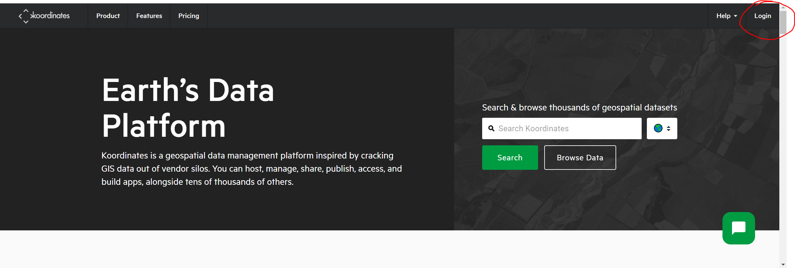
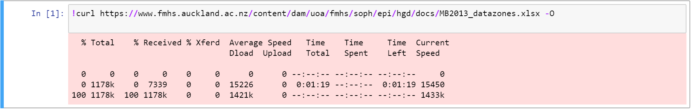

# First part - Dataset Building  
* [Video Tutorials](#Vid)
* [Introduction](#Instruct)
* [Census population](#Census)
* [Deprivation Index](#Dep)  
  
## Video Tutorials 
There are 3 sub-sections for the first part, all of them are quite short. They should be all you need to know to complete this part.  
* Calling an API in Python
* Using an apply function
* Using the lambda function

Here is the video tutorial, use the new YouTube Chapter feature to jump to the desired sub-section. [Video Link](https://youtu.be/dvZxu2PjOW8)

## Introduction to the Assignment  

Do not worry, we have provided all the resources for you, but you do need to do some work. Your task is to add 2 columns to the dataset I provided, one column 
for population count, and another for the Deprivation Index.

Please note! The New Zealand land is broken down into units, and one of these units is known as the Statistical Area Unit 1 (SA1). I have a column in the dataset which
tells us which SA1 unit each property belongs to. The population and Deprivation index we are adding on for each property would be WITH RESPECT to these SA1 units.  

Read more here! http://archive.stats.govt.nz/methods/classifications-and-standards/classification-related-stats-standards/geographic-areas/pg4.aspx#gsc.tab=0

## To get the 2018 Census population  
* 1 - register an account at koordinates here, it's completely free: https://koordinates.com/  
  

* 2 - get the API KEY
    
  
  
* 3 - read the documentation thoroughly - I have even given you the link!  
  
	https://help.koordinates.com/query-api-and-web-services/vector-query/  
  
  
* 4 - Navigate to this page here to find the layer id. This is a required parameter!  
  
	https://datafinder.stats.govt.nz/layer/104612-2018-census-individual-part-1-total-new-zealand-by-statistical-area-1/  
	  
  
  
The column which will give us the 2018 census population is "C18_CURPop". Let me know if you run into problems!

## To get the Deprivation Index 
* Please use the 2018 version created by the University of Otago - accessible here:  
https://www.otago.ac.nz/wellington/departments/publichealth/research/hirp/otago020194.html  
Feel free to learn more about what the Deprivation index is about!  
  
You can either download the file manually and upload to where your Azue notebook is, or you can use this command in your notebook:  
!curl  _link\_to\_file\_here_  -o   
   
   
In which case it will download the file into your project folder. Either way, you will need to read in the downloaded file with pd.read_excel or pd.read_csv.  
  
Now in order to join the Deprivation Index from your downloaded file onto the assignment dataset, please look at this link here: https://pandas.pydata.org/pandas-docs/stable/reference/api/pandas.DataFrame.merge.html  
The join only requires a single line of code and I don't believe it will be too difficult!  
