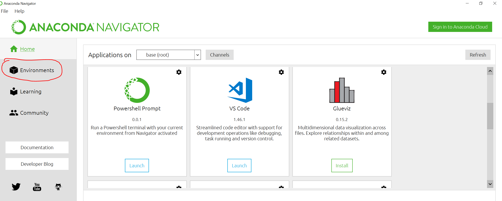
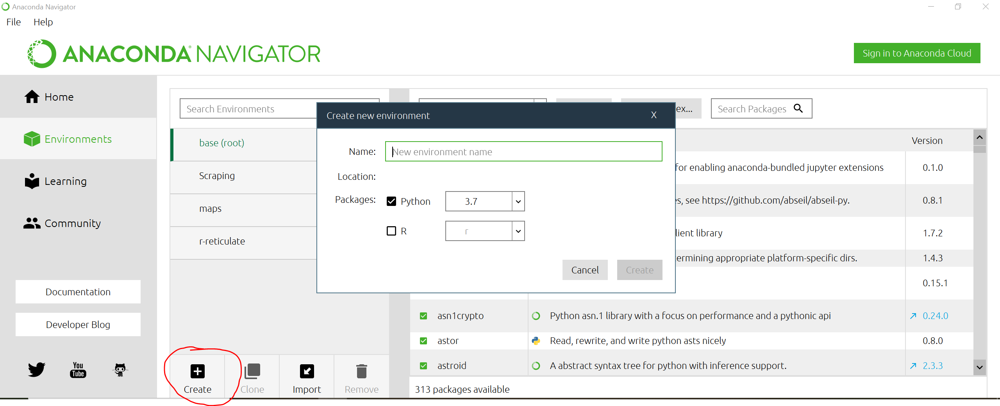
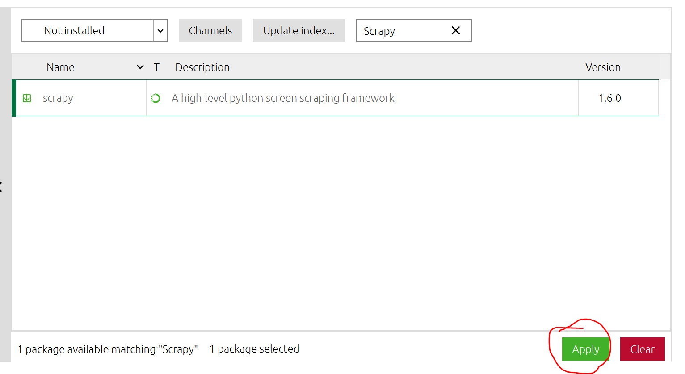

## Table of contents
* [Introduction](#intro)
* [Video tutorials](#Vid)
* [Software requirements](#software)
* [Regular expressions](#regular)

## Introduction 
Webscraping is not part of the assessment, but may be a useful skill to have when building datasets. I have covered briefly how to use Scrapy for scraping 
non javascript webpages in the tutorial. Feel free to email me your scraping code if you want to practice but run into problems.  
  
Note I have uploaded 2 spiders, one of them I demonstrated in the video, the other is so you have more examples. I really hope you guys have a crack at using this!    
  
## Video tutorials 
* [Webscraping tutorial](https://youtu.be/gNJxumBknck) (45mins)  

## Software requirements 
For webscraping with Scrapy it is recommended that you install the Anaconda distribution package, as it contains numerous data science software
and python libraries. Anaconda can be installed here:  

https://www.anaconda.com/products/individual

* Once installed, you will need to install Scrapy, click on Environments here:
  

	If this is the first time using Anaconda, you can create a new virtual environment. Any packages or dependencies you install into the virtual environment would 
	belong solely to that virtual environment.  
	

* Give the environment a name, make sure Python is selected, and click "Create".
  

* To install Scrapy, select the environment, select "Not Installed", and Type in "Scrapy" in the searchbox:
   

* Select Scrapy then click "Apply"
 

* Go back to home, select your virtual environment, and launch visual studio code
     

  
  
  
## Regular Expressions 
There were regular expressions in my webscraping tutorial and that might seem daunting if you have never come across it before, but it's not that bad.   

This is a great resource! - https://www.datacamp.com/community/tutorials/python-regular-expression-tutorial

Otherwise here is a crash course!  

"." matches anything, ie. wildcard  
\[0-9\] matches a number  
\[a-z\] matches a lower case letter  
\[A-Z\] matches an upper case letter  
\[a-zA-Z\] matches a any letter  
\[a-zA-Z0-9\] matches any alphanumeric character  
  
? means 0 or 1 instance. So \[0-9\]? indicates a pattern where there is 0 or 1 number  
\+ means 1 or more instance. So \[0-9\]+ indicates a pattern where there is 1 or more number(s)    
\* means 0 or more instance. So \[A-Z\]\* indicates a pattern where there is 0 or more upper case letters  
  
**Regex in action**  
I will introduce a simple functions from the regex library in python:  
re.findall(pattern, string, flags=0)  
  

