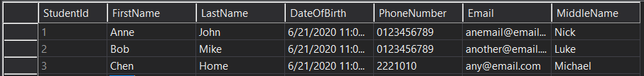
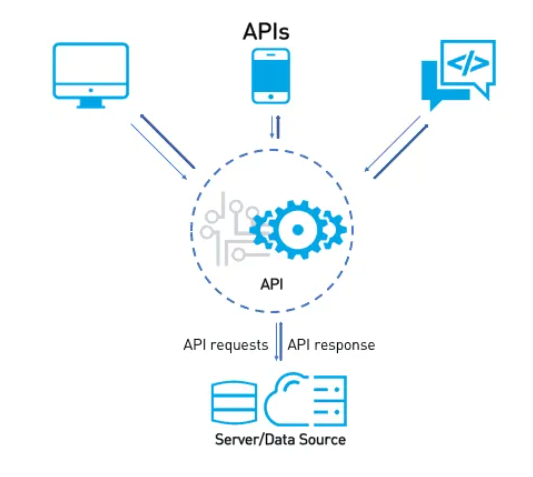

# Learning Outcomes
- Relational Database Overview
- RESTful API Overview
- Interaction between Database and API Server

# Relational Database Overview
Database is a structured collection of information that recognizes relations between stored items of information.

Data are stored in tables (entities) with columns (attributes).
Most software applications require a database.

Example: Student table that we are using for this module

# RESTful API Overview
An Application Program Interface (API) is a set of protocols and tools for building software applications. An API specifies how software components should interact with each other.

Here in this module we will focus on RESTful API which uses HTTP requests to GET, PUT, POST and DELETE data, i.e. the users can create/read/update/delete (CRUD) data in the database.

# Interaction between Database and API
When the users access an application on their devices, the APIs will be called and manipulate the data from the database.

For example, if the user wants to register an account of a website, they will input their information and click "Submit". A POST API will be called and the new information will be saved into the database.

*Figure 1: Interaction between APIs and Database (2018)*

# References
1. [6 Differences between Web Services vs API (SOAP & REST examples)](https://testautomationresources.com/api-testing/differences-web-services-api/)
