# DevOps 101

We are going to have a look at how a build and release pipeline is set up for a react app.

In this tutorial we are going to:
* Create a GitHub repository
* Create a base react app in your repository (make sure you have [npm](https://www.npmjs.com/get-npm) installed)
* Create a build pipeline
* Create a release pipeline

## Video tutorial
[Our DevOps app video tutorial could be found here](https://youtu.be/RJDlDFrzZjo)

## Written documentation
Ok lets start by making the GitHub repository and cloning it to our local environment.

[Create a new repository](https://github.com/new). I have name my repository 'msa-devops-2020' and opted to have it initialised with a README so that I can immediately clone it.
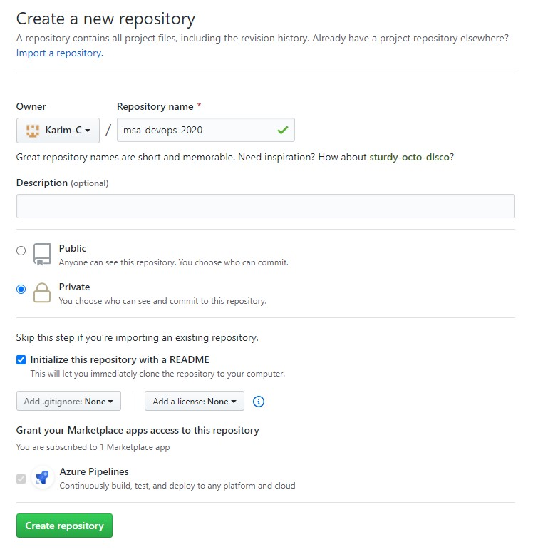

Now copy the web URL for your repository (image below).

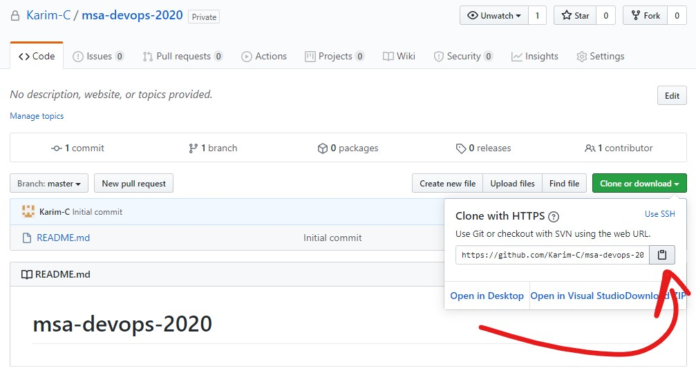
Open up a command shell and enter the following command:
```
git clone <INSERT_THE_WEB_URL_FOR_YOUR_REPO>
```
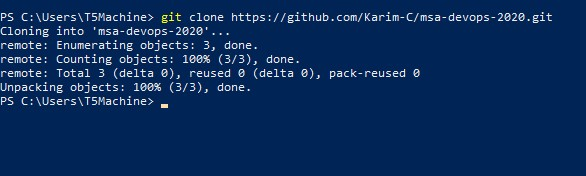


## Create React base project.

```
cd <INSERT_NAME_OF_YOUR_REPO>
npx create-react-app my-app --template typescript
```
This command will take a while to do it's thing so take the time to stretch.
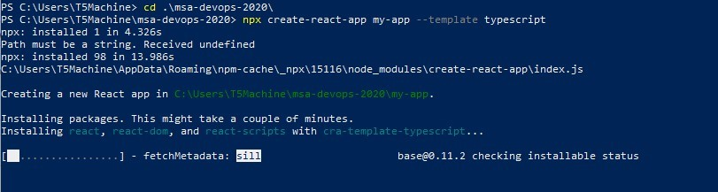
Any warnings can be ignored.
Test that everything is working correctly by running the following command:
```
cd my-app
npm start
```
The command will start up the development serve and open up your browser (at http://localhost:3000/). You should be able to see the base react app.

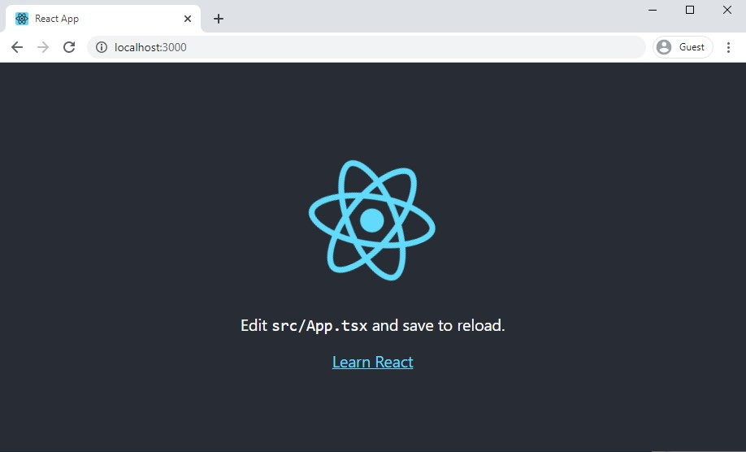

Now that we have that set up lets stage, commit and push our changes to our repository.

```shell
cd ..
git add .
git commit -m "add base React app"
git push origin master
```

## Create web app

We will be deploying app to a Windows web app. So lets create the web app. Navigate to the [Azure portal](https://portal.azure.com/) and select "Create a resource" for the menu on the left.


Then search for "Web App"

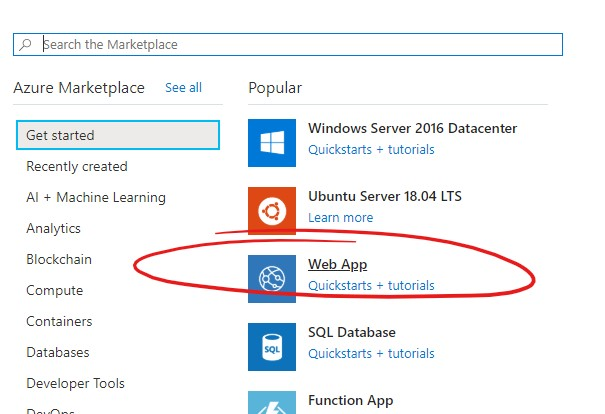

Fill out the information for your web app:

* Operating System = windows
* Runtime stack = Node 12 LTS

Make sure you choose a free tier.

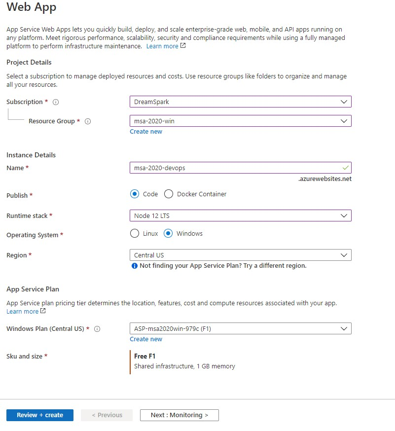

Click "Review + create" and then "create". Once the resource has been created click on "Go to resource" and take note of the URL since this is where we will check later if the deployment of the app was successful.

## Create Build Pipeline
Sign in to you Azure DevOps (Here are [sign up instructions](https://docs.microsoft.com/en-us/azure/devops/pipelines/get-started/pipelines-sign-up?view=azure-devops) if you don't already have an account).
Once you're logged-in create a new organistion and a project within the organisation.
You'll either be prompted to create a new organisation or you'll find the
"New organization" link on the left (as can be seen in the image below).

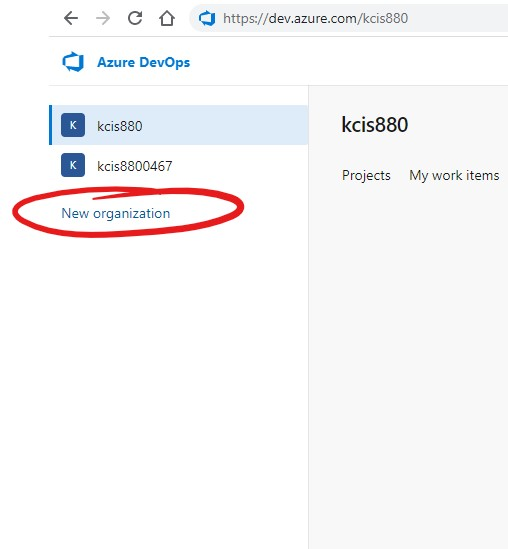

Then enter name for your organisation. The organisation can hold one or more projects and your projects can hold one or more of your pipelines.

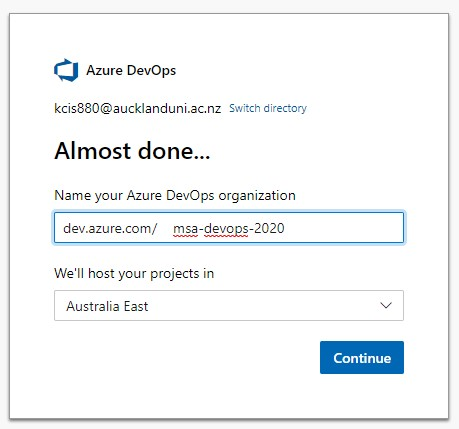

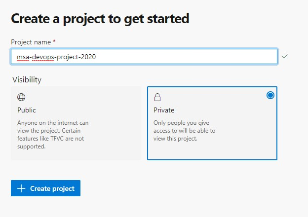

Click on "Pipelines" on the left

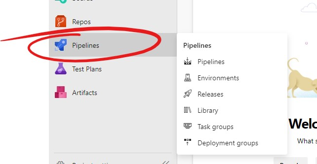

Then select "Create Pipeline" on the page that pops up.

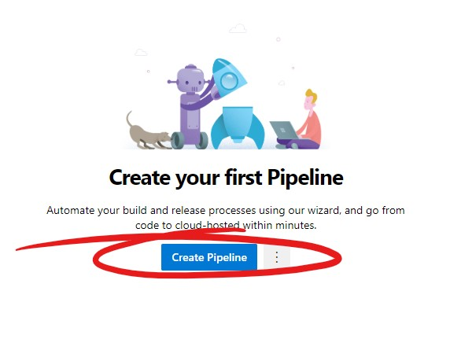

Now we have to tell Azure where to look for our code. Choose the GitHub option.

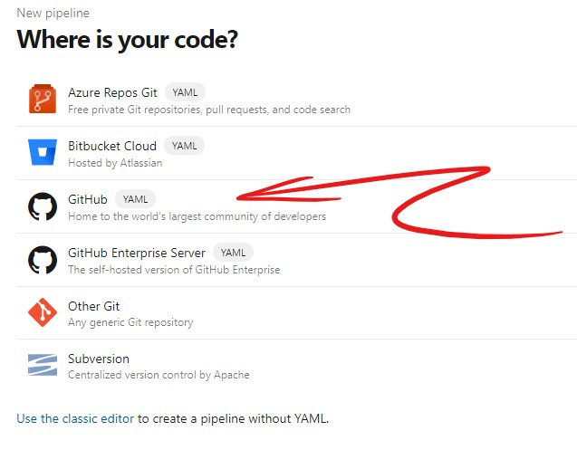

Select the repository we just created.

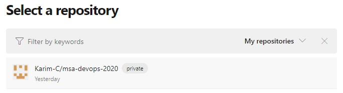

Choose the "Starter pipeline" option. The other option is for when you already have a YAML in your repository which defines an Azure pipeline which we do not yet have.

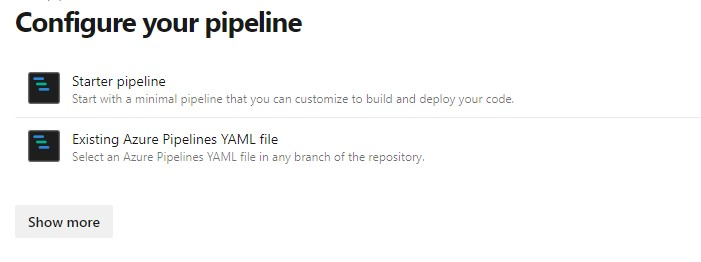

Azure will give you a starter pipeline YAML file. The YAML file defines the pipeline. Later we will be editing the YAML file to make changes to our pipeline so that we can build and deploy our base React app. For now just choose "save and run."

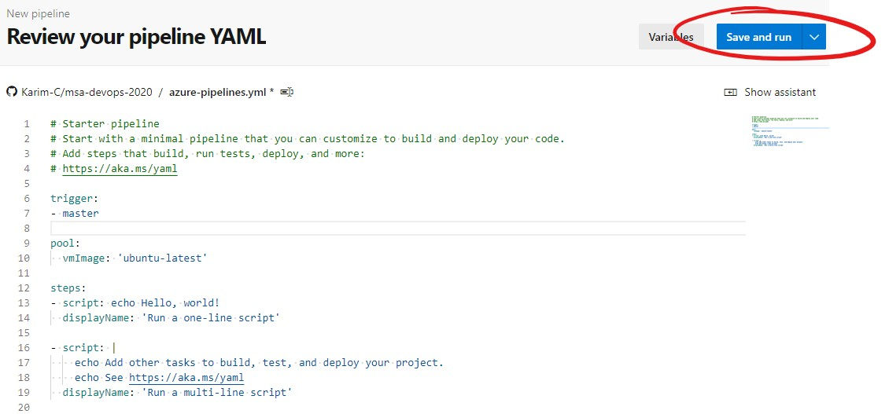

A window will pop up telling you that saving will commit an azure-pipelines.yml file to your repository. This is the file which defines the pipeline.

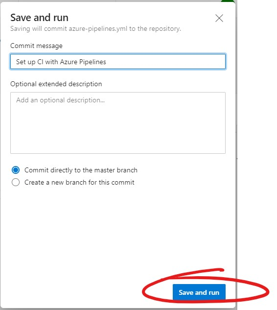

Once you have clicked "save and run" Azure will save start up a job to run the pipeline. You will see on the screen that the job will initially have a status of queued. Click on the job and you can watch as it executes.

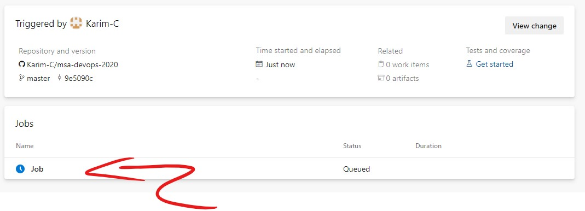

Once you have clicked on the job you will see the following:

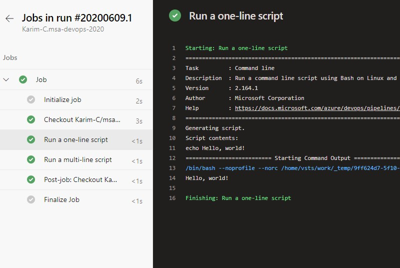

This view is great for debugging your pipeline. If something goes wrong come back to this view to investigate.

Now to edit our pipeline lets edit the YAML file defining the pipeline in the browser. On the left hand-side select "Pipelines." Hover over the pipeline we just ran and click on the three dots on the right and then select edit.

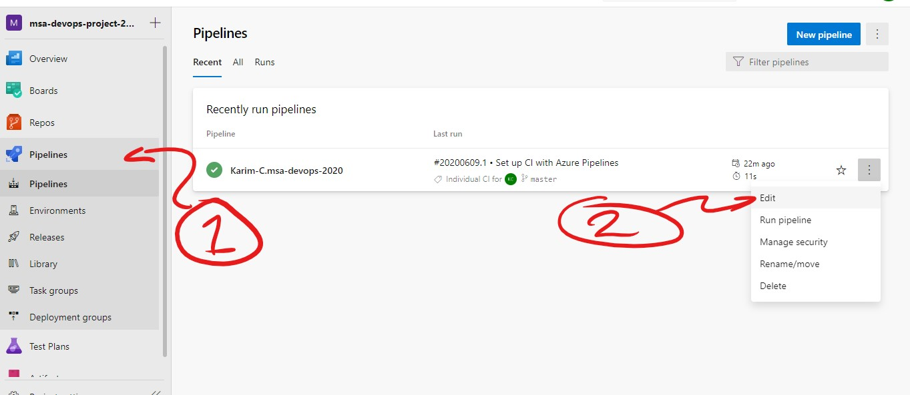

You could also make edits to the azure-pipelines.yml that is now in your repository. The azure-pipelines.yml file defines the pipeline so if you edit that file, the pipeline will change. Now that you have connected the pipeline to your repository every time you push a commit to the master branch the pipeline will be run.

Lets take a closer look at the starter pipeline and understand what it is doing before we make any changes. For a full explanation of the YAML schema have a look a the [docs](https://aka.ms/yaml) they are really good.

```YAML
# Starter pipeline
# Start with a minimal pipeline that you can customize to build and deploy your code.
# Add steps that build, run tests, deploy, and more:
# https://aka.ms/yaml

trigger:
- master

pool:
  vmImage: 'ubuntu-latest' # the OS of the agent running the pipeline. Both 'macOS-latest' and 'windows-latest' are also available

steps:
- script: echo Hello, world!
  displayName: 'Run a one-line script' # name shown when the task runs

- script: |
    echo Add other tasks to build, test, and deploy your project.
    echo See https://aka.ms/yaml
  displayName: 'Run a multi-line script'
```

The "trigger" section tells us the pipeline only run when a commit is pushed to the master branch. I you also wanted the pipeline to trigger when a commit is pushed to a branch called "develop" it would look like this:
```
trigger:
- master
- develop
```
If you want to get super fancy:
```yaml
trigger:
  branches:
    include:
    - features/* # pipeline is triggered by any branch that fits this description. E.g. features/database-connection would trigger the pipeline
    exclude:
    - features/experimental/* # ignore any commits push to branches that fit this pattern. E.g. a commit pushed to features/experimental/database-connection would be ignored
  paths:
    exclude:
    - README.md # This tells the pipeline not to trigger if the only change was made was made to the README.md file regardless of on which branch the change is made.
```
A pipeline usually has a number of steps under the heading "steps:" as you can see in the starter pipeline description which has two steps. A new process is started for each step which means that environmental variables can not be shared between steps. Any changes made to the file system are of course preserved between steps.

Each of the two step are command-line task which we can see because they are marked with "script:". These command-line tasks are super useful because you can do whatever you usually do in the terminal giving you a lot of flexibility. Azure provides some pre-built task which you should make use of if they are available, but if not use a command-line task.

Let's make some changes to the starter pipeline. We will create a variable for the root directory and the build directory.
```yaml
variables:
  rootDir: 'my-app'
  buildDir: '$(rootDir)/build'
```
Here the rootDir variable contains the string 'my-app' and the buildDir variable contains the string 'my-app/build'. If you find yourself using the same value multiple times in your pipeline it might be a good idea to turn it into a variable. To access the variables throughout the pipeline use the following syntax: $(VARIABLE_NAME)

We will need to use npm in the pipeline so lets install Node. The following task will find, download and cache the version of Node.js which we specified which in this case is version 10.x

```yaml
steps:
- task: NodeTool@0
  inputs:
    versionSpec: '10.x'
  displayName: 'Install Node.js'
```

Before we deploy our React app lets build it. To build it lets use a script task.

```YAML
- script: |
    cd $(rootDir)
    npm install
    npm run build
    cd ..
  displayName: 'npm install and build'
```
In the script we start by changing directory (using the cd command) because we need to be in the 'my-app' folder to run the next commands because 'my-app' is the root of the React app. The "npm install" installs the packages and the "npm run build" builds the app and puts the production ready build in the "build" folder in our current directory ("my-app").

Now that we have the build lets zip it. If you are editing the azure-pipeline.yml file the Azure DevOps browser interface then you can use the assistant on the right to generate tasks.

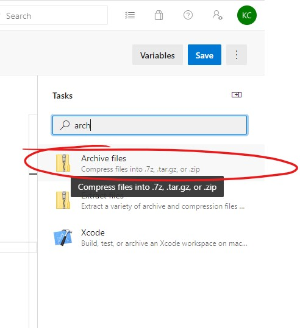


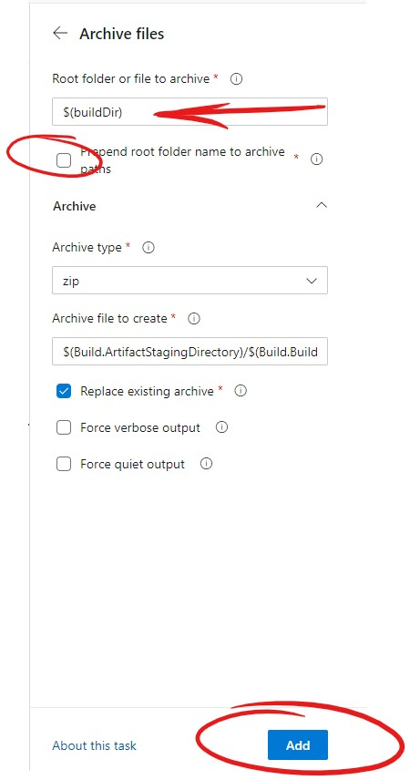

Put the $(buildDir) as the root folder to archive since this folder contains our build. Uncheck the option "Prepend root folder name to archive paths" since we want the archive to contain only the contents of the build folder and not the build folder with the content. Once you click "Add" the text defining the task will be generated where ever your cursor is in the yml so make sure its in the right place.
The following text should be generated.

 ```YAML
 - task: ArchiveFiles@2
   inputs:
     rootFolderOrFile: '$(buildDir)'
     includeRootFolder: false
     archiveType: 'zip'
     archiveFile: '$(Build.ArtifactStagingDirectory)/$(Build.BuildId).zip'
     replaceExistingArchive: true
 ```

 Now we have the archive we need to publish it so that our release pipeline can grab it and deploy it to our web app.

 Type "Publish build artifacts" into the assistant on the right and select the task with the same name. You don't need to make any changes since we are creating the archive in a standard location, '$(Build.ArtifactStagingDirectory)', this task will look in that location and publish the zip in that directory.

 When you finished make sure to click "Save" in the top right and commit the changes you made to your repository.


Full azure-pipeline.yml file used for reference.

```YAML
trigger:
- master

variables:
  rootDir: 'my-app'
  buildDir: '$(rootDir)/build'

pool:
  vmImage: 'ubuntu-latest'

steps:
- task: NodeTool@0
  inputs:
    versionSpec: '10.x'
  displayName: 'Install Node.js'

- script: |
    cd $(rootDir)
    npm install
    npm run build
    cd ..
  displayName: 'npm install and build'

- task: ArchiveFiles@2
  inputs:
    rootFolderOrFile: '$(buildDir)'
    includeRootFolder: false
    archiveType: 'zip'
    archiveFile: '$(Build.ArtifactStagingDirectory)/$(Build.BuildId).zip'
    replaceExistingArchive: true

- task: PublishBuildArtifacts@1
  inputs:
    PathtoPublish: '$(Build.ArtifactStagingDirectory)'
    ArtifactName: 'drop'
    publishLocation: 'Container'
```


## Create a Release Pipeline.

Now lets create the release pipeline. A release pipeline is responsible for taking the build artifact from our build pipeline and deploying it.

In the menu on the left select "Releases".

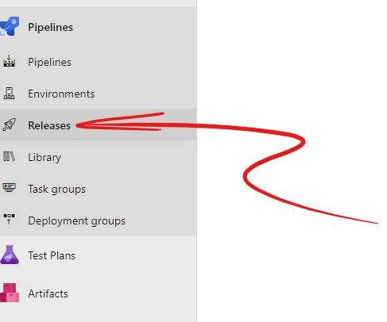

Create a new release pipeline. Select the "Azure App Service deployment" template.

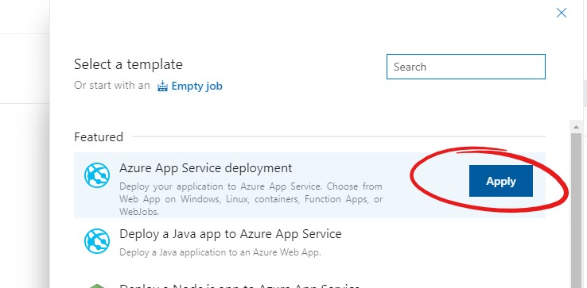

 Now lets specify the artifact that the release pipeline should deploy (the artifact is what we created with the build pipeline). Click on "Add an artifact". Make sure the source type is "Build" and then fill out the information about the artifact. When your done press "Add".

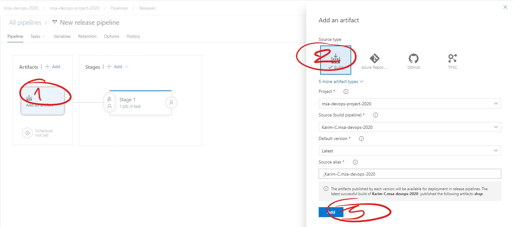

Click on "Tasks" in the menu along the top.

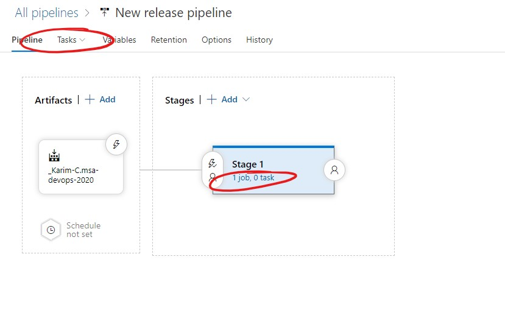

Enter the information about the Azure app service we created earlier. Make sure you enter the correct subscription, App type and App service name.  

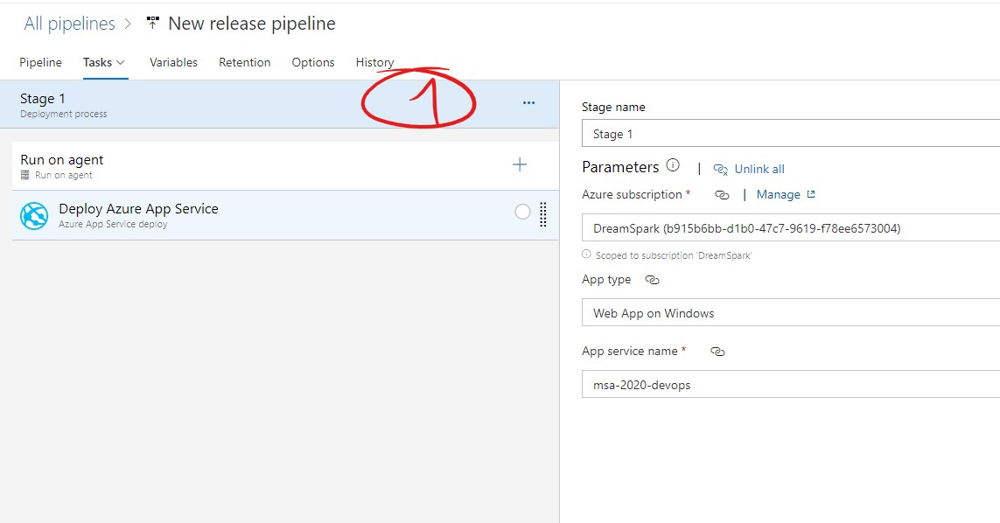

Now navigate back to the view of the whole release pipeline by clicking "Pipeline" (1) and then click on the thunder bolt (2) on the artifact. This is where we can set a continuous deployment trigger.

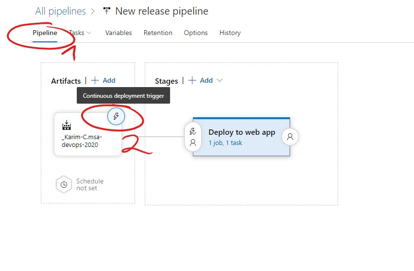

Lets enable the pipeline to create a release every time a new build is produced by our build pipeline. Add a build branch filter so that only builds from the master branch is released.

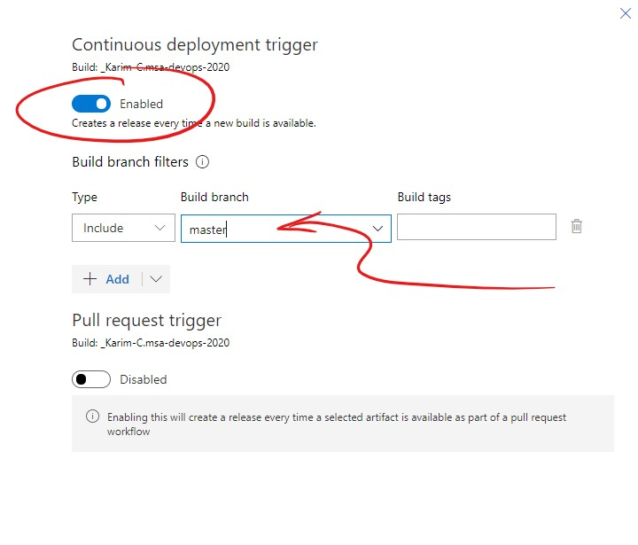

Change the name of the release pipeline (1). Then click on "save" in the top right-hand corner and on "Ok" to save the release pipeline.

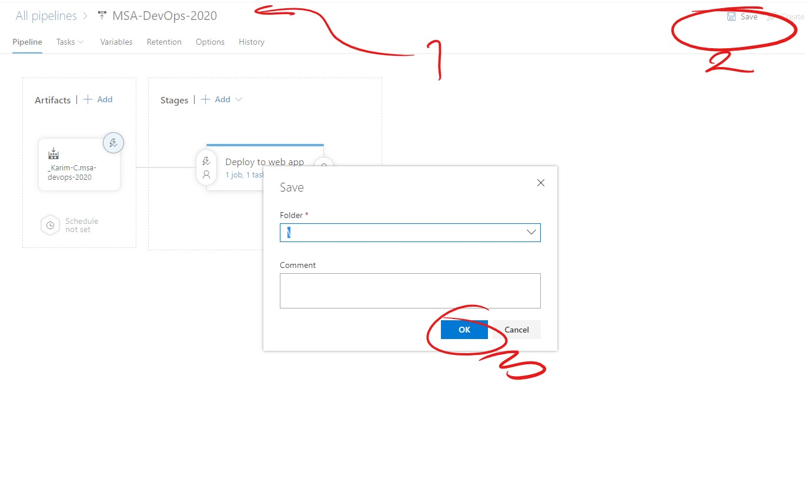

Now lets create a release manually by clicking on the "Create release" button next to the "save" button. The release pipeline will pick up the build that our build pipeline produced early and deploy it to the web app.

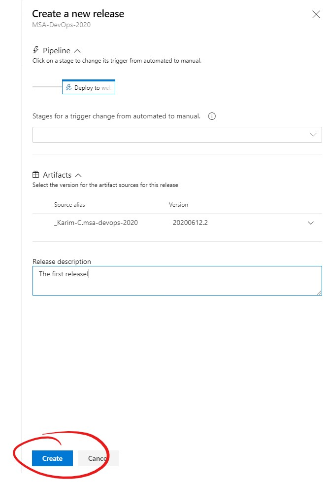

It will take a couple of minutes for the deployment to finish. Navigate to your web app via the URL to see the deployed React app.

## Testing the pipeline

Now if everything is working. We should be a able to make some changes locally on our computer to the files in our local git repo, push those changes and have our pipeline build our app and deploy our app to the web app.

Change the contents of the App.tsx file (my-app/src/App.tsx) to the following:

```typescript
import React from 'react';
import logo from './logo.svg';
import './App.css';

function App() {
  return (
    <div className="App">
      <header className="App-header">
        
        <p>
          MSA 2020
        </p>
        <a
          className="App-link"
          href="https://msa.azurewebsites.net/"
          target="_blank"
          rel="noopener noreferrer"
        >
          MSA website
        </a>
      </header>
    </div>
  );
}

export default App;
```

Then navigate to your local git repository in the terminal and run the following commands to stage, commit and push the changes we just made to the App.tsx file to our remote git repository in GitHub.

```
git pull
git add .
git commit -m 'update text and logo'
git push origin master
```
Note: We first pull from our remote repository because we commit the azure-pipelines.yml file directly to our repository through Azure.

You can the pipelines as then work on building and releasing the changes you made.

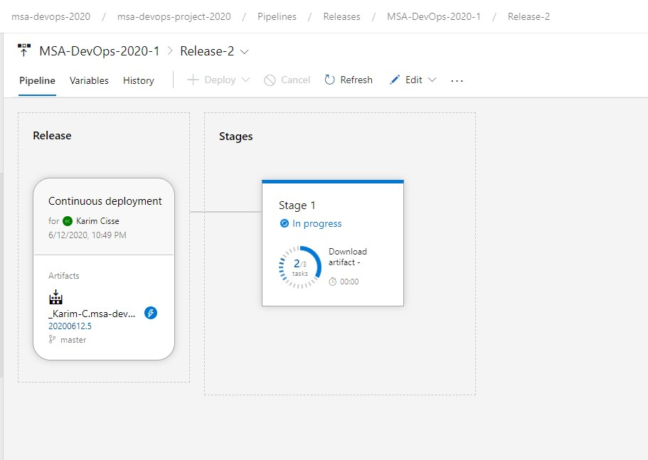

If all goes well you'll be able to see the updates when you navigate to your web app via the URL.

# Assessment Criteria

Complete the following Microsoft Learn modules:
* [Create a build pipeline with Azure Pipelines](https://docs.microsoft.com/en-gb/learn/modules/create-a-build-pipeline/)
* [Implement a code workflow in your build pipeline by using Git and GitHub](https://docs.microsoft.com/en-gb/learn/modules/implement-code-workflow/)
* [Run quality tests in your build pipeline by using Azure Pipelines](https://docs.microsoft.com/en-gb/learn/modules/run-quality-tests-build-pipeline/)

* Invite kcis880@aucklanduni.ac.nz and paul.tanchareon@studentpartner.com to your Azure DevOps project.

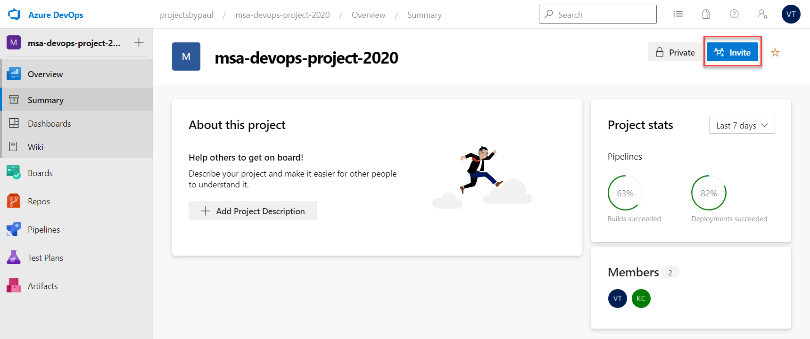

* Add `Karim-C` and `Paulvtan` to your GitHub repository (GitHub Repo -> Settings -> Manage access -> Invite a collaborator -> Copy the pending invite link)

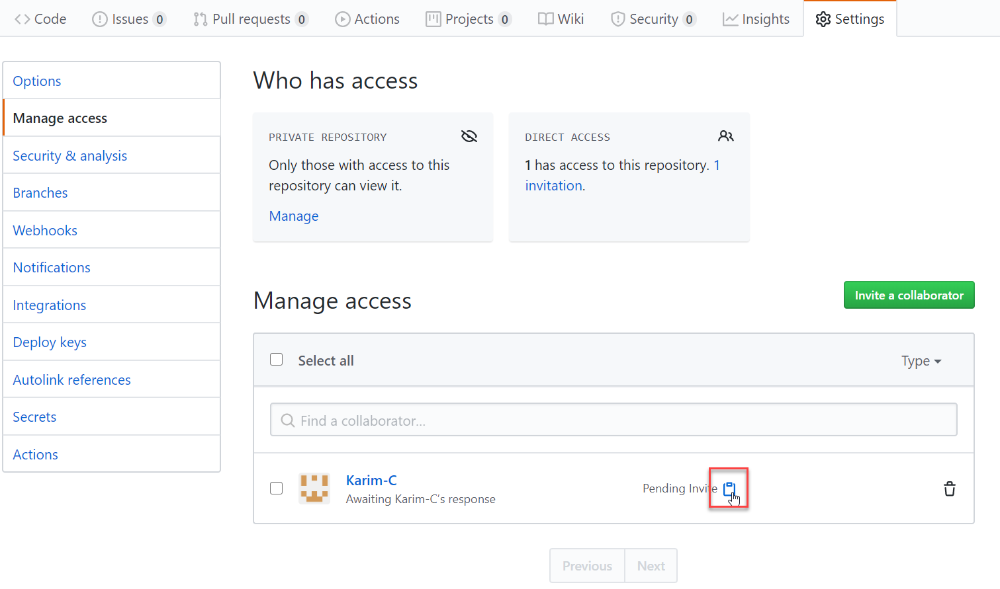

* Submit the GitHub collaborator invite link to the submission form.

Make sure to have the following ready when you submit.

1. Azure build pipeline
   * Enable a continuous deployment to create releases on new commits to `develop` and `master` branches.
2. Azure release pipeline
   * Enable a continuous deployment to deploy your release to Azure for new commits to `master` branch.
3. A deployed website on Azure (Add the URL of your website on your project README)
4. Write a short description of your build and release pipelines in your project README (This is a your chance to explain to us what you have implemented for your build & release pipeline and why 😃)
5. GitHub repo (Add us as contributor → Submit the invite link)

Submission form on the main page

