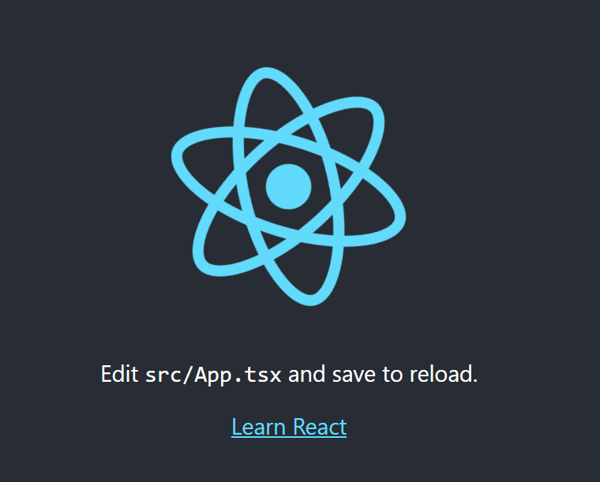

# Web App
### Learning Outcomes from this module:

* What is React?
* What are components?
* How do I keep my passwords and API keys safe on GitHub?
* Why typescript?
* How to create a basic react application with typescript
* How to navigate the terminal within Visual Studio Code
* How to link custom global stylesheets to your entire react application.

# Requirements
During This Section you will need to the following installed
* [Visual Studio Code](https://code.visualstudio.com/download) 
* [Node](https://nodejs.org/en/download/)
* Github Account
* You can also install the React Dev Tools extension for [firefox](https://addons.mozilla.org/en-US/firefox/addon/react-devtools/) or [chrome](https://chrome.google.com/webstore/detail/react-developer-tools/fmkadmapgofadopljbjfkapdkoienihi?hl=en)

# Compulsory Microsoft Learn Module to complete
1. [Microsoft Learn - Build a simple website](https://docs.microsoft.com/en-us/learn/modules/build-simple-website/?fbclid=IwAR2WwQj5XVBffvbMuEQdFxiNutvb6T7q4_8q-e-uagi1Tixhrwzjt48D5E0)

# Before we get started
- If you are already familiar with React, Hooks, and API key security then feel free to start in the 'Getting Started'

## YouTube tutorial
[Our web app video tutorial could be found here](https://youtu.be/571Cxv8Sj04)

### What is React?

React is a Javascript library, that is used to create user interfaces. React can be used to make mobile apps with React Native, or in our case, make a website.

When the React site loads, index.html will load, and attempt to run the react javascript code. If Javascript is not enabled on your browser, it will fail, and display index.html, if your browser does have JavaScript enabled, it will load index.tsx! If you're curious you can look around in there, but I wouldn't recommend changing anything.

index.tsx will call App.tsx, which is our 'main' function/component.

React uses components, which become the building blocks of your interface. A component could be as small as a single button, and as large as an entire form.

Below I have made hello world in React.
```tsx
import React from 'react';

function App() {
  return (
    <div>
        Hello, World!
    </div>
  );
}

export default App;
```

#### Lets pull this apart
At the top we have the import statements, importing the different packages we need, in this case, just React.

```tsx
import React from 'react';
```

Then we declare a function, if you are not familiar with JS/TS syntax then I would highly recommend starting with the Microsoft Learn section of the assignment, which is creating a basic website in HTML, CSS and JavaScript.
```tsx
function App() {

}
```
The App function returns the React elements that will make the user interface. I have used a div tag here, as the return method will only take a single parent element, however it can have many child elements.

Having everything wrapped in a parent div is fine.
```tsx
return (
    <div>
        <h1>Heading</h1>
        <p>Paragraph</p>
        <footer>footer</footer>
    </div>
);
```

But having three different tags in a return statement will not work.
```tsx
return (
    <h1>Heading</h1>
    <p>Paragraph</p>
    <footer>footer</footer>  
)

```

It doesn't need to be a div, having a parent p tag will works too.
```tsx
return (
    <p>Paragraph</p>
)
```

You can have as many different functions as you want, but the function you see above is the our component that we are exporting, as seen by the final lines export statement.
```tsx
export default App;
```

## Export and Import
When you export a function using export default 
```tsx
export default MyCustomComponent;
```
you can import it into another component using
```tsx
import MyCustomComponent from './Components/MyCustomComponent';
```

If you export a function using regular export 
```tsx
export function QuickMath(){
    var one = 1;
    var two = 2;
    var four = two + two;
    var three = four - one;
    return (three);
}
export default MyCustomComponent;
```
you can even use both at the same time, when you import multiple components from the same location, remember to put commas between them.
```tsx
import  MyCustomComponent, { QuickMath } from './Components/MyCustomComponent';
```

## Hooks
Now were going to dive straight into some React.

What is state?
React doesn't work like other common patterns you may be used to, like MVC.

In React the DOM and state, or what is visible on screen is the model, but as its whats visible to the user, it is also the view at the same time, and the components are the controller. React becomes the M, V and C in this instance.

The state is not visible on screen, and here we can have the variables that are part of a components scope. Anytime the state variables are updated, the component re-renders.

#### How do we change state?
```tsx
    const [SearchQuery, setSearchQuery] = useState<string | null>("");
```
The first parameter is SearchQuery, which is the name of our state object. This can be called just like any other variable in the component. The second parameter is setSearchQuery, which is the method called when you want to change/setState.

The useState() function sets the initial values of state.

# How do I keep my passwords and API keys safe when I push my code to GitHub?
Keeping your API keys safe on GitHub is really important.

If you are using an API that costs money, such as text messaging or email, and someone gets hold of your key, they can rack up massive bills.

There are bots that go through GitHub looking for accidentally committed keys and use them for spam or other malicious purposes.

If you are trusted with an API key, and someone else uses the key, they will have your privileges and will be using your identity.

## Using an .env file you can keep this info safe, and still use it on your local machine!
Step 1.) Add .env.local to your git ignore file, theres no point setting all this up, and then committing the file full of all your secrets anyway.

Step 2.) Create the .env.local file.

Step 3.) Add your secrets like this
```
REACT_APP_API_KEY = 'secretkey12345'
```
you need to add the REACT_APP_ part, so that React knows, that you know what you are doing, and that the variable you are declaring, is intended for React to use.

Step 4.) To use the secret key in your env file use
```tsx
process.env.REACT_APP_API_KEY
```
It will return your string that is stored in the env file.

This is often used, so that on a local machine, you have a env.local, the development staging server will have an env.dev and the production server will have an env.production . This allows you to keep the same code, but have different secrets for each, or even use different pieces of code depending on the environment.

# What are we making
Today we will be creating a basic image gallery react application. Specifically we will be making an application for the NASA image of the day library.


## Getting Started
## [Introduction](https://medium.freecodecamp.org/when-should-i-use-typescript-311cb5fe801b) 

As developers we more than often will be working in teams, which could mean that our codebase is large, a type system can help you avoid a lot of common errors. This is especially true for single-page applications.

Any time one developer could introduce breaking changes, it’s generally good to have some sort of safety mechanism.

The TypeScript transpiler reveals the most obvious mistakes — though it won’t magically eliminate the need for debugging.

If your codebase isn’t all that big, it probably doesn’t make sense to make it larger by adding type annotations. I’ve converted 180+ files from JavaScript to TypeScript, and in most cases it added roughly 30% to the total code size.

Typescript gives react developers many benefits such as autocomplete, type checking, compile time errors which increases productivity and other refactoring benefits. 


# Getting started

Make sure you have npm installed, and updated Run: 

If not follow this to [install](https://www.npmjs.com/get-npm)

```sh
[sudo] npm i -g npm to update  
```

This quick start guide will teach you how to wire up TypeScript with [React](http://facebook.github.io/react/).


We'll use the [create-react-app](https://github.com/facebookincubator/create-react-app) tool to quickly get set up.

We assume that you're already using [Node.js](https://nodejs.org/) with [npm](https://www.npmjs.com/).
You may also want to get a sense of [the basics with React](https://facebook.github.io/react/docs/hello-world.html).

# Create-react-app

We're going to use the create-react-app because it sets some useful tools and canonical defaults for React projects.
This is just a command-line utility to scaffold out new React projects.

# Create our new project

We'll create a new project called `my-app`:

```shell
npx create-react-app my-app --template typescript --use-npm
```

--template typescript tells create react app to use the typescript template for the react project.

At this point, your project layout should look like the following:

```text
my-app/
├─ .git/
├─ node_modules/
├─ public/
├─ src/
│  └─ ...
├─ .gitignore
├─ package.json
├─ tsconfig.json
└─ package-lock.json
```

Of note:

* `tsconfig.json` contains TypeScript-specific options for our project.
* `package.json` contains our dependencies, as well as some shortcuts for commands we'd like to run for testing, previewing, and deploying our app.
* `public` contains static assets like the HTML page we're planning to deploy to, or images. You can delete any file in this folder apart from `index.html`.
* `src` contains our TypeScript and CSS code. `index.tsx` is the entry-point for our file, and is mandatory.

# Running the project

Running the project is as simple as running in the console which can be opened by pressing ctrl + ` or going into View in your menu tab and clicking on terminal. 

```sh
npm run start
```

This runs the `start` script specified in our `package.json`, and will spawn off a server which reloads the page as we save our files.
Typically the server runs at `http://localhost:3000`, but should be automatically opened for you.

Every time you save a change to your application it should be automatically rebuilt. This helps us by allowing us to quickly see changes and therefore iterate on a more frequent basis.

After you've run the project for the first time you should be greeted with the following screen.



# Start Coding

Before we begin lets go ahead and remove the code that we will not be using which is provided to us by the create react app template. Specifically in the `App.tsx` file in the src folder lets remove the lines within App function till we are left with the following

```tsx
import React from 'react';
import './App.css';

function App() {
  return (
    <div>
    </div>
  );
}

export default App;
```

## Search Bar

The first set of component that we will create is the Search bar. For the search bar we want to be able to search by text and also apply a date for the range we search by. So to achieve this we will have a text field and two pickers one for the start date and one for the end date finally one button to confirm the search.

To achieve this lets first begin by creating a new folder in the src folder called `Components` and within this folder create a folder for our search bar `SearchBarComponent`. Inside this folder create one file called `SearchBar.tsx` and one called `SearchBar.css` that will store our react component and the appropriate css respectively.

In the `SearchBar.tsx` lets begin by defining the outline for a functional component. We can do this by adding the following.

```tsx
import React from 'react';
import './SearchBar.css';

function SearchBar() {
    return (
        <div>
        </div>
    )
}

export default SearchBar
```

The first thing we will add to our SearchBar is a text field. To do this lets first install material ui so we can have a nice looking text field to do this in your console simply write 
```
npm install @material-ui/core
```

Now in the search bar lets import and add the TextField component from material ui do this by adding `import { Textfield } from '@material-ui/core'` now we can add it to our search bar component.

```tsx
import React, {useState} from 'react';
import { Grid, TextField } from '@material-ui/core';
import './SearchBar.css';

interface ISearchBarProps{
    SetUserInput: (a: IUserInput) => void;
}


function SearchBar() {

    const [SearchQuery, setSearchQuery] = useState<string | null>("");
    const handleSearchQueryChange = (s: string | null) =>{
        setSearchQuery(s);          
    }

    const [HasFocus, setHasFocus] = useState<boolean>(false);

    return <div className="SearchBarContainer">
        <Grid container spacing={3}>
            <Grid item xs={6} sm={3}>
                <TextField
                    required
                    id="outlined-required"
                    label="Search"
                    variant="outlined"
                    error={HasFocus && SearchQuery === ""}
                    onClick={() => setHasFocus(true)}
                    value={SearchQuery}
                    onChange={e => handleSearchQueryChange(e.target.value)}
                />
            </Grid>
        </Grid>
    </div>
```
We use the grid component to help with the scaling on our application. We can specify different sizes for components to take when the screen is a different size. You can note the use of react hooks which we use to provide state for the Text field values.

Now lets add the two date pickers to allow users to select the values for start and end date for their search. This is relatively easy to do however we will need to first install a couple new packages to allow us to do this.

```sh
npm i @material-ui/pickers
npm i @date-io/date-fns@1.x date-fns
```

With this we can add the following code which will render the pickers in our search bar.

First well add the two imports that we need for the components. 
```tsx
import { KeyboardDatePicker, MuiPickersUtilsProvider } from '@material-ui/pickers';
import DateFnsUtils from '@date-io/date-fns';
```

Now we can add the state that we will need for our two components to store the value selected. For this add the following before the return of the SearchBar function 
```tsx
    const [StartDate, setStartDate] = useState<Date | null>(
        new Date('2014-08-18'),
    );
    const handleStartDateChange = (date: Date | null) => {
        setStartDate(date);
    };

    const [EndDate, setEndDate] = useState<Date | null>(
        new Date('2020-05-18'),
    );

    const handleEndDateChange = (date: Date | null) => {
        setEndDate(date);
    };
```

You'll notice we have two different state values as we require one for the start date and one for the end date as these can change independently. Next well add the render code to do this update your return to look like the following

```tsx
    return <div className="SearchBarContainer">
        <Grid container spacing={3}>
            <Grid item xs={6} sm={3}>
                <TextField
                    required
                    id="outlined-required"
                    label="Search"
                    variant="outlined"
                    error={HasFocus && SearchQuery === ""}
                    onClick={() => setHasFocus(true)}
                    value={SearchQuery}
                    onChange={e => handleSearchQueryChange(e.target.value)}
                />
            </Grid>

            <MuiPickersUtilsProvider utils={DateFnsUtils}>
                <Grid item xs={6} sm={3}>
                    <KeyboardDatePicker
                        disableToolbar
                        variant="inline"
                        format="MM/dd/yyyy"
                        margin="normal"
                        id="StartDate"
                        label="Start Date (optional)"
                        value={StartDate}
                        onChange={handleStartDateChange}
                        KeyboardButtonProps={{
                            'aria-label': 'change date',
                        }}
                    />
                </Grid>
                <Grid item xs={6} sm={3}>
                    <KeyboardDatePicker
                        disableToolbar
                        variant="inline"
                        format="MM/dd/yyyy"
                        margin="normal"
                        id="EndData"
                        label="End Date (optional)"
                        value={EndDate}
                        onChange={handleEndDateChange}
                        KeyboardButtonProps={{
                            'aria-label': 'change date',
                        }}
                    />
                </Grid>
            </MuiPickersUtilsProvider>
        </Grid>
    </div>
```

The wrapper for the Pickers is MuiPickerUtilsProvider which allows you to tell what date management library you want to use for our case we are using date-fns.

Finally we need a way to let the user decide when they have confirmed their selection and to do this we want to have a submit button for our search bar. In the onClick of this function well want to verify that the text they are searching for is a non null value. Lets start by updating the import from `@material-ui/core` to also import the button we will use do this by changing the line to `import { Button, Grid, TextField } from '@material-ui/core';`. The lets update the render by adding the button to do this update your return to look like the following

```tsx
    return <div className="SearchBarContainer">
        <Grid container spacing={3}>
            <Grid item xs={6} sm={3}>
                <TextField
                    required
                    id="outlined-required"
                    label="Search"
                    variant="outlined"
                    error={HasFocus && SearchQuery === ""}
                    onClick={() => setHasFocus(true)}
                    value={SearchQuery}
                    onChange={e => handleSearchQueryChange(e.target.value)}
                />
            </Grid>

            <MuiPickersUtilsProvider utils={DateFnsUtils}>
                <Grid item xs={6} sm={3}>
                    <KeyboardDatePicker
                        disableToolbar
                        variant="inline"
                        format="MM/dd/yyyy"
                        margin="normal"
                        id="StartDate"
                        label="Start Date (optional)"
                        value={StartDate}
                        onChange={handleStartDateChange}
                        KeyboardButtonProps={{
                            'aria-label': 'change date',
                        }}
                    />
                </Grid>
                <Grid item xs={6} sm={3}>
                    <KeyboardDatePicker
                        disableToolbar
                        variant="inline"
                        format="MM/dd/yyyy"
                        margin="normal"
                        id="EndData"
                        label="End Date (optional)"
                        value={EndDate}
                        onChange={handleEndDateChange}
                        KeyboardButtonProps={{
                            'aria-label': 'change date',
                        }}
                    />
                </Grid>
            </MuiPickersUtilsProvider>
            
            <Grid item xs={6} sm={3}>
                <Button variant="contained" color="primary" onClick={handleSubmit}>
                    Submit
                </Button>
            </Grid>
        </Grid>
    </div>
```

Now we will want to create a common interface that will be used to represent the search bars selection. Lets make a new folder in `src` called `Common` and inside lets have a file called `Interfaces.ts` all this file will do is export our interfaces that are to be used in multiple components to avoid duplication. Add the following to the Interfaces file

```ts
export interface IUserInput {
    SearchQuery: (string |null );
    StartDate: (Date | null);
    EndDate: (Date | null);
}
```

Now back in our search bar lets import this by doing `import { IUserInput } from '../../Common/Interfaces'`. Finally lets add the function to handle our onClick checking we can do this by defining a function to handle this check add the following to your code inside the SearchBar function.

```ts
    const handleSubmit = () => {
        if (SearchQuery?.length !== 0 && SearchQuery !== null && SearchQuery !== "") {
            let UserInput: IUserInput = {
                SearchQuery: SearchQuery,
                StartDate: StartDate,
                EndDate: EndDate
            }
            props.SetUserInput(UserInput);
        } else {
            setHasFocus(true);
        }
    }
```

You can see here that if the user has not matched our validation we can toggle focus to the search query which is our TextField. Otherwise we will call a function which is taken in as a prop ( think of this like a input to a method here we are passing a function in). But we need to define what the props are so lets do this by creating and adding our interface. Update your SearchBar file to include the following

```ts
interface ISearchBarProps {
    SetUserInput: (a: IUserInput) => void;
}

function SearchBar(props: ISearchBarProps) {
```
This says that our SearchBar component expects a function in its props called SetUserInput that takes a IUserInput object and doesn't return anything.

At this point your Search Bar file should look like the following

```tsx
import React, { useState } from 'react';
import { KeyboardDatePicker, MuiPickersUtilsProvider } from '@material-ui/pickers';
import DateFnsUtils from '@date-io/date-fns';
import { Button, Grid, TextField } from '@material-ui/core';
import { IUserInput } from '../../Common/Interfaces'
import './SearchBar.css';

interface ISearchBarProps {
    SetUserInput: (a: IUserInput) => void;
}


function SearchBar(props: ISearchBarProps) {
    const [StartDate, setStartDate] = useState<Date | null>(
        new Date('2014-08-18'),
    );
    const handleStartDateChange = (date: Date | null) => {
        setStartDate(date);
    };

    const [EndDate, setEndDate] = useState<Date | null>(
        new Date('2020-05-18'),
    );

    const handleEndDateChange = (date: Date | null) => {
        setEndDate(date);
    };

    const [SearchQuery, setSearchQuery] = useState<string | null>("");
    const handleSearchQueryChange = (s: string | null) => {
        setSearchQuery(s);
    }
    const [HasFocus, setHasFocus] = useState<boolean>(false);

    const handleSubmit = () => {
        console.log(SearchQuery);

        if (SearchQuery?.length !== 0 && SearchQuery !== null && SearchQuery !== "") {
            let UserInput: IUserInput = {
                SearchQuery: SearchQuery,
                StartDate: StartDate,
                EndDate: EndDate
            }
            props.SetUserInput(UserInput);
        } else {
            setHasFocus(true);
        }
    }
    
    return <div className="SearchBarContainer">
        <Grid container spacing={3}>
            <Grid item xs={6} sm={3}>
                <TextField
                    required
                    id="outlined-required"
                    label="Search"
                    variant="outlined"
                    error={HasFocus && SearchQuery === ""}
                    onClick={() => setHasFocus(true)}
                    value={SearchQuery}
                    onChange={e => handleSearchQueryChange(e.target.value)}
                />
            </Grid>

            <MuiPickersUtilsProvider utils={DateFnsUtils}>
                <Grid item xs={6} sm={3}>
                    <KeyboardDatePicker
                        disableToolbar
                        variant="inline"
                        format="MM/dd/yyyy"
                        margin="normal"
                        id="StartDate"
                        label="Start Date (optional)"
                        value={StartDate}
                        onChange={handleStartDateChange}
                        KeyboardButtonProps={{
                            'aria-label': 'change date',
                        }}
                    />
                </Grid>
                <Grid item xs={6} sm={3}>
                    <KeyboardDatePicker
                        disableToolbar
                        variant="inline"
                        format="MM/dd/yyyy"
                        margin="normal"
                        id="EndData"
                        label="End Date (optional)"
                        value={EndDate}
                        onChange={handleEndDateChange}
                        KeyboardButtonProps={{
                            'aria-label': 'change date',
                        }}
                    />
                </Grid>
            </MuiPickersUtilsProvider>

            <Grid item xs={6} sm={3}>
                <Button variant="contained" color="primary" onClick={handleSubmit}>
                    Submit
                </Button>
            </Grid>
        </Grid>
    </div>
}

export default SearchBar
```

You can now add some css for this component by adding the following to your SearchBar.css file

```css
.SearchBarContainer {
    margin: auto;
    margin: 20px;
}

.MuiGrid-root div{
    margin: auto;
    display: flex;
    justify-content: center;
}
```
## Card

Now lets create our card component which will display the information in segregated blocks. Each card will represent one new piece of information in our case a new image.

Lets start by creating a `MediaCardComponent` folder in our `Components` folder. Then lets add two files to this folder `MediaCard.css` and a `MediaCard.tsx`

We want to render a card which is provided by material-ui more information about cards can be learned here [Material UI Cards](https://material-ui.com/components/cards/)

Add the following code to the `MediaCard.tsx` file

```tsx
import React from 'react';
import Card from '@material-ui/core/Card';
import CardActionArea from '@material-ui/core/CardActionArea';
import CardContent from '@material-ui/core/CardContent';
import CardMedia from '@material-ui/core/CardMedia';
import Typography from '@material-ui/core/Typography';
import './MediaCard.css';

interface IMediaCardProps {
    ImageUrl: string | undefined;
    Description: string | undefined;
}

function MediaCard(props: IMediaCardProps) {
    return (
        <div>
            <Card className="MediaCardContainer">
                <CardActionArea>
                    <CardMedia
                        className="MediaCardImage"
                        image={props.ImageUrl}
                    />
                    <CardContent>
                        <Typography variant="body2" color="textSecondary" component="p" className="MediaCardDescription">
                            {props.Description}
                        </Typography>
                    </CardContent>
                </CardActionArea>
            </Card>
        </div>
    )
}

export default MediaCard
```
This component will expect us to pass in a Image object which will have the url of the image and the description for the image which we will then display on our card. For images and other media we want to use the CardMedia component within our card. Lets also apply some styling to this component as well add the following to the css file

```css
.MediaCardContainer{
    max-width: 310px;
    margin: auto;
}
.MediaCardImage{
    height: 200px !important;
    max-width: 310px;
}
.MediaCardDescription{
    height: 200px;
    overflow-y: scroll;
    overflow-wrap: break-word;
}
```

## Card Grid
Next we want to display all the images that match our search so for this lets display them in a grid format. Lets start by creating the folders and files we will need for this component. In our `Components` folder lets add a new folder called `MediaGridComponent` and in this lets add two files `MediaGrid.tsx` and `MediaGrid.css` for the component and its styling which will be needed.

In the css file add the following which will be used to style our component.

```css
.MediaGridContainer{
    margin: auto !important;
    padding: 20px;
    width: 100% !important;
}

.MediaGridCard{
    display: flex;
    align-content: center;
    justify-content: center;
}
```

In the component file lets start by defining the outline for the component as well as importing some of the components that we will use

```tsx
import React, { useState, useEffect } from 'react';
import MediaCard from '../MediaCardComponent/MediaCard';
import { Grid } from '@material-ui/core';
import './MediaGrid.css';

interface IState {
    links: any[];
    data: any[];
}
interface IMediaGridProps {
    SearchQuery: (string | null);
    StartDate: (Date | null);
    EndDate: (Date | null);
}
function MediaGrid(props: IMediaGridProps) {
    return (
        <div>
        </div>
    )
}

export default MediaGrid
```
The first thing we need to do is to make the request to our API to get the images for the given search request that we have. However we only want to do this if our props change as making the request takes time and will slow down our application if done every time. To achieve this we can make use of reacts useEffect. Update your component to be as follows

```tsx
import React, { useState, useEffect } from 'react';
import MediaCard from '../MediaCardComponent/MediaCard';
import { Grid } from '@material-ui/core';
import './MediaGrid.css';

interface IState {
    links: any[];
    data: any[];
}
interface IMediaGridProps {
    SearchQuery: (string | null);
    StartDate: (Date | null);
    EndDate: (Date | null);
}
function MediaGrid(props: IMediaGridProps) {
    const [ItemArray, setItemArray] = useState<IState[]>([{ links: [], data: [] }]);

    useEffect(() => {
        fetch('https://images-api.nasa.gov/search?media_type=image&q=' + props.SearchQuery + '&year_start=' + props.StartDate?.getFullYear() + '&year_end=' + props.EndDate?.getFullYear())
            .then(response => response.json())
            .then(response => {
                setItemArray(response.collection.items)
            })
            .catch(() => console.log("it didn't work")
            );

    }, [props.SearchQuery, props.EndDate, props.StartDate]);

    return (
        <div>
        </div>
    )
}

export default MediaGrid
```
What the useEffect first argument is the function to run when the items provided in the second argument change. So if the SearchQuery, EndDate or StartDate change the function will be re run. The fetch in the function makes a get request to the nasa API we have chosen and append the relevant query fields to allow the request to be made with the specific filter. We then convert the response to json and set our items in the array to match.

Next we can make each of these items into a card component that we created before. To achieve this we can make use of the forEach function on any array. Add the following after your useEffect and before the return.

```tsx
    var Cards: JSX.Element[] = [];
    ItemArray.forEach((el: IState, i: Number) => {
        if (!el || !el.links[0] || !el.data) {
            return;
        }
        Cards.push(
            <Grid key={"card_"+i} item sm={6} md={4} lg={3} className="MediaGridCard">
                <MediaCard ImageUrl={el['links'][0]['href']} Description={el["data"][0]['description']} />
            </Grid>)
    })
```

This defines an array of components that can be rendered (cards array). Then it loops through our stored items and for each of the items it checks if the relevant information is there and then it will map it to a card which will be added to the Cards array.

Finally lets render this cards array do this by adding the following to the return method.

```tsx
    return (
        <div>
            <Grid container spacing={3} className="MediaGridContainer">
                {Cards}
            </Grid>
        </div>
    )
```

This will render each of the cards in the grid format as we have desired. Your component should look like the following at this point 

```tsx
import React, { useState, useEffect } from 'react';
import MediaCard from '../MediaCardComponent/MediaCard';
import { Grid } from '@material-ui/core';
import './MediaGrid.css';

interface IState {
    links: any[];
    data: any[];
}
interface IMediaGridProps {
    SearchQuery: (string | null);
    StartDate: (Date | null);
    EndDate: (Date | null);
}
function MediaGrid(props: IMediaGridProps) {
    const [ItemArray, setItemArray] = useState<IState[]>([{ links: [], data: [] }]);

    useEffect(() => {
        fetch('https://images-api.nasa.gov/search?media_type=image&q=' + props.SearchQuery + '&year_start=' + props.StartDate?.getFullYear() + '&year_end=' + props.EndDate?.getFullYear())
            .then(response => response.json())
            .then(response => {
                setItemArray(response.collection.items)
            })
            .catch(() => console.log("it didn't work")
            );

    }, [props.SearchQuery, props.EndDate, props.StartDate]);

    var Cards: JSX.Element[] = [];
    ItemArray.forEach((el: IState, i: Number) => {
        if (!el || !el.links[0] || !el.data) {
            return;
        }
        Cards.push(
            <Grid key={"card_"+i} item sm={6} md={4} lg={3} className="MediaGridCard">
                <MediaCard ImageUrl={el['links'][0]['href']} Description={el["data"][0]['description']} />
            </Grid>)
    })

    return (
        <div>
            <Grid container spacing={3} className="MediaGridContainer">
                {Cards}
            </Grid>
        </div>
    )
}

export default MediaGrid
```

## Wiring it up

Finally lets wire up our components that we have created we can do this by adding the following to our `App.tsx` file

```tsx
import React,{useState} from 'react';
import './App.css';
import SearchBar from './Components/SearchBarComponent/SearchBar';
import MediaGrid from './Components/MediaGridComponent/MediaGrid';
import { IUserInput } from './Common/Interfaces';
import {createMuiTheme, MuiThemeProvider} from '@material-ui/core';

const theme = createMuiTheme({
  breakpoints: {
    values: {
      xs: 0,
      sm: 700,
      md: 960,
      lg: 1280,
      xl: 1920,
    },
  },
})

function App() {
  const [UserInput, setUserInput] = useState<IUserInput>({
    SearchQuery: "Mars",
    StartDate: new Date('2014-08-18T21:11:54'),
    EndDate: new Date('2018-08-18T21:11:54'),
  });
  function SetUserInput(a: IUserInput) {
    setUserInput(a);    
  }

  return (
    <div className="App" >
      <MuiThemeProvider theme={theme}>
          <SearchBar SetUserInput={(a: IUserInput) => SetUserInput(a)}/>
          <MediaGrid SearchQuery={UserInput.SearchQuery} StartDate={UserInput.StartDate} EndDate={UserInput.EndDate}/>
      </MuiThemeProvider>
    </div>
  );
}

export default App;
```

What this does is create the sizes for our grids in our application so they know at what screen size to change to a different size. Then we define the state and a setter for the state to allow our SearchBar component to set the state which can then be used by our MediaGrid component. Finally we render the SearchBar and the MediaGrid components.

And thats it you now have a successfully working application.

# Assignment
For your assignment, you will need to create a new web application which meets the following criteria

1. Create a new typescript and react web app
2. Connect this application to a different 3rd party REST API
3. Allow users to input information that will be utilised by the API
4. Make use of a UI library like Material-UI.
5. Utilise source control through GitHub.  

You will need to submit your GitHub repo url and ensure that you have completed the compulsory Microsoft Learn Module


### Microsoft Learn
1. [Microsoft Learn - Build a simple website](https://docs.microsoft.com/en-us/learn/modules/build-simple-website/?fbclid=IwAR2WwQj5XVBffvbMuEQdFxiNutvb6T7q4_8q-e-uagi1Tixhrwzjt48D5E0)

Checklist
- Code available on GitHub (You will need to submit GitHub repo url)
- Microsoft Learn Module
